# open_r1_reprod

## 目录
- [简介](#简介)
- [快速开始](#快速开始)
- [模型评估](#模型评估)
- [奖励函数曲线](#奖励函数曲线)
- [推理长度与学习率曲线](#推理长度与学习率曲线)
- [loss&kl&grad曲线](#loss&kl&grad曲线)
- [格式混乱](#格式混乱)
- [多语言混合](#多语言混合)
- [模型推理](#模型推理)
- [system影响](#system影响)
- [总结](#总结)

## 简介
open-r1-reprod是open-r1的复现项目，使用GRPO对0.5B、1.5B、3B、7B的qwen模型在[MATH-lighteval](https://huggingface.co/datasets/DigitalLearningGmbH/MATH-lighteval)数学数据集上进行训练。本项目观察并分析了不同尺寸模型的推理能力，基于规则奖励的各种hack，多语言混合推理等现象。本项目并不算成功，但也有一些有趣的发现，欢迎交流讨论。

本项目主要参考以下项目和资料：  
- https://github.com/huggingface/open-r1 [代码流程]
- https://huggingface.co/datasets/DigitalLearningGmbH/MATH-lighteval [数据来源]

## 快速开始
本项目使用open-r1项目的代码，修改配置文件config_grpo.yaml，**本项目的训练细节可查看config_grpo.yaml**。   
```bash
# 下载open-r1项目
git clone https://github.com/huggingface/open-r1
cd open-r1

accelerate launch --config_file=recipes/accelerate_configs/zero2.yaml --num_processes=7 src/open_r1/grpo.py --config ../config_grpo.yaml
```

## 模型评估
本项目在模型评估阶段，设置2种模式的system，用来测试不同system的区别，在默认情况下，使用system2。
```python
system1 = "You are Qwen, created by Alibaba Cloud. You are a helpful assistant."

system2 = "You are a helpful AI Assistant that provides well-reasoned and detailed responses. You first think about the reasoning process as an internal monologue and then provide the user with the answer. Respond in the following format: <think>\n...\n</think>\n<answer>\n...\n</answer>"
```
启动命令：
```bash
python eval.py
```

## 奖励函数曲线
设置system_prompt，使模型能够遵守`<think>\n...\n</think>\n<answer>\n...\n</answer>`的格式。
```bash
system_prompt: "You are a helpful AI Assistant that provides well-reasoned and detailed responses. You first think about the reasoning process as an internal monologue and then provide the user with the answer. Respond in the following format: <think>\n...\n</think>\n<answer>\n...\n</answer>"
```
基于规则的奖励函数包括准确率奖励(accuracy_reward)和格式奖励(format_reward、tag_count_reward)，总奖励是三者之和。其中，tag_count_reward是因为`<think>\n...\n</think>\n<answer>\n...\n</answer>`太难，模型可能很难遵守，因此对于出现部分格式的回答，通过tag_count_reward给予部分奖励。  
```python
def tag_count_reward(text: str) -> float:
    count = 0.0
    if text.count("<think>\n") == 1:
        count += 0.25
    if text.count("\n</think>\n") == 1:
        count += 0.25
    if text.count("\n<answer>\n") == 1:
        count += 0.25
    if text.count("\n</answer>") == 1:
        count += 0.25
    return count
```
观察奖励曲线，可以发现0.5B的模型在accuracy_reward和format_reward中几乎没有变化，只有在tag_count_reward中有一定提升，达到50%。这说明了太小的模型无法通过GRPO提升回答的准确率，也无法很好地遵守格式。  

1.5B的模型在accuracy_reward中有一定的提升，达到40%，在format_reward和tag_count_reward中达到接近100%。对于3B和7B的模型，也有类似的曲线，区别在于accuracy_reward提升幅度不同，说明GRPO在1.5B的模型开始发挥作用，越大的模型效果越好。
<table>
  <tr>
    <td>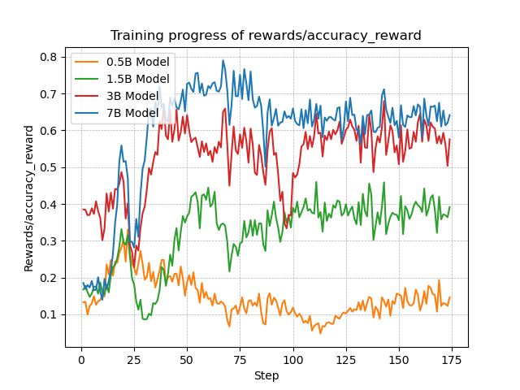</td>
    <td>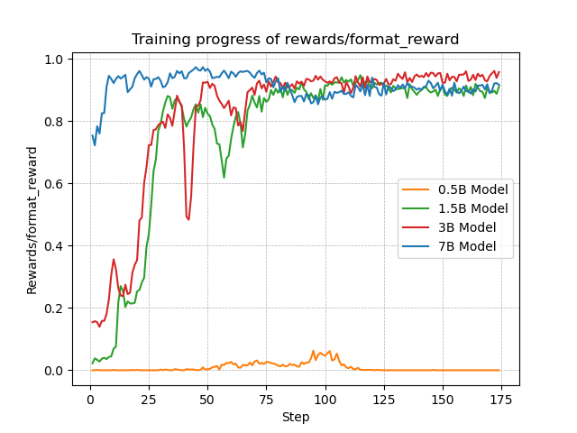</td>
  </tr>
  <tr>
    <td>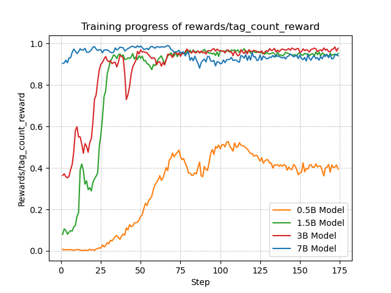</td>
    <td>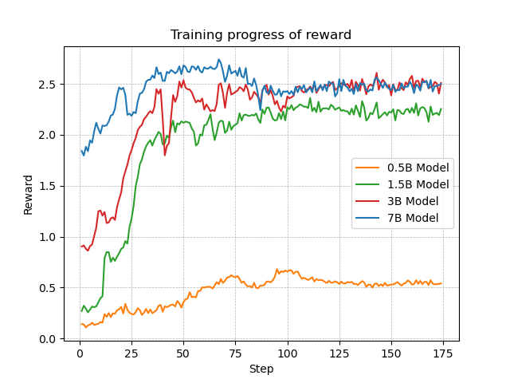</td>
  </tr>
</table>

## 推理长度与学习率曲线
不同参数的模型的推理长度总体平稳，并未出现随着训练的增加，推理长度增长的现象。

学习率使用cosine，最大值为3.0e-06。
<table>
  <tr>
    <td>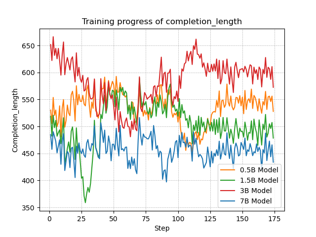</td>
    <td>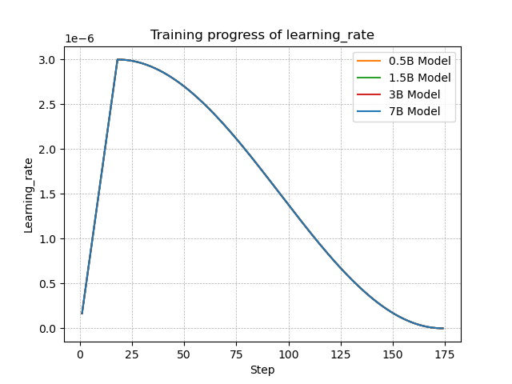</td>
  </tr>
</table>

## loss&kl&grad曲线
由于7B模型的loss&kl&grad曲线有非常剧烈的波动，如在loss曲线中可以达到75.132，0.5B、1.5B和3B模型的loss无法观察，因此将0.5B、1.5B和3B模型的loss&kl&grad曲线单独绘制(右侧图)。

7B模型在35step左右出现剧烈波动，loss值达到75.132，在95step时loss值达到4.1998。1.5B模型也出现了较大的波动，loss值最高达到0.4545。kl&grad也表现出了与loss相同的变化趋势，不再赘述。

loss&kl&grad曲线剧烈的波动可能将影响模型的性能，但是在奖励函数曲线上并未表现出来。测试1.5B模型(包括1epoch、2epoch和3epoch)时，模型老是输出一堆乱码。7B模型在1epoch(58step)时表现良好，但是在2epoch(116step)和3epoch(174step)时，也是出现一堆乱码。这些现象可能与剧烈的loss&kl&grad曲线波动有关。

<table>
  <tr>
    <td></td>
    <td>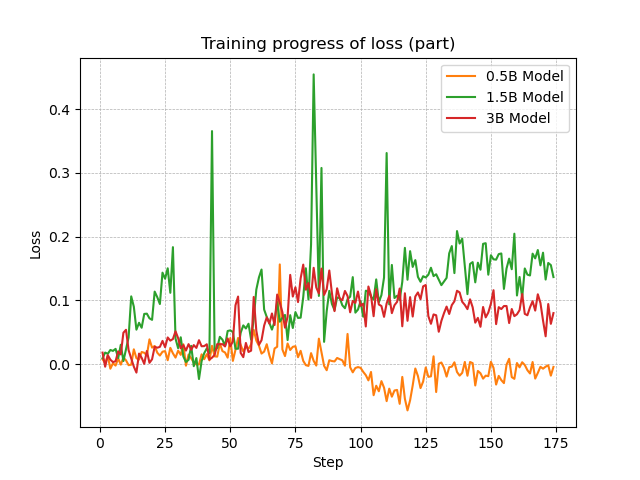</td>
  </tr>
  <tr>
    <td>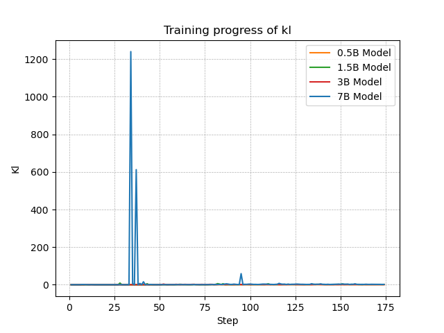</td>
    <td>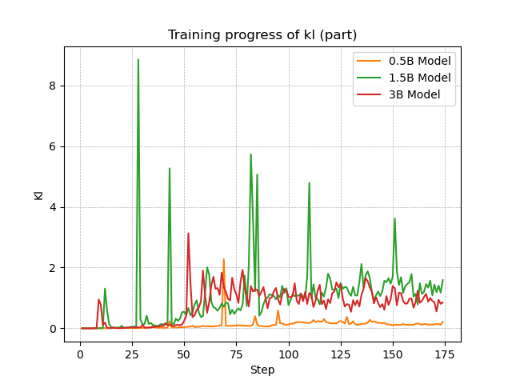</td>
  </tr>
  <tr>
    <td>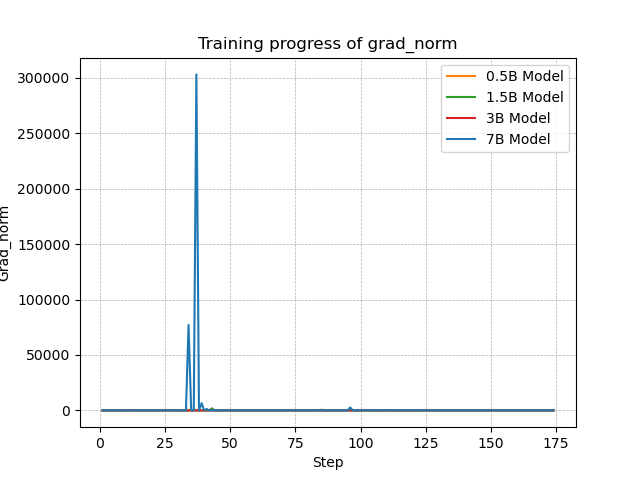</td>
    <td>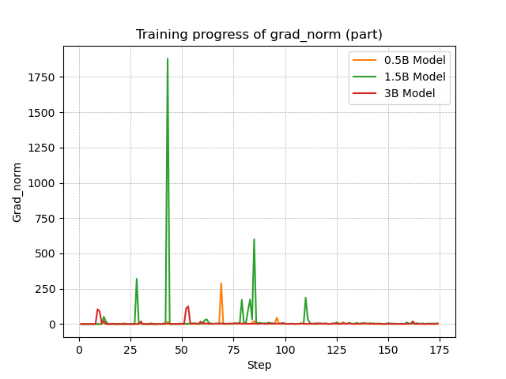</td>
  </tr>
</table>

## 格式混乱
没有完整的`<think>\n...\n</think>\n<answer>\n...\n</answer>`格式；回答不以`<think>`开头；凭空捏造`</journalism>`。
```bash
# model_path = Qwen-0.5B-GRPO

用户：你是谁
助手： 我是来自阿里云的超大规模语言模型，我叫通义千问。很高兴为您服务！有什么问题或需要帮助的地方随时告诉我。
<think>
作为一个人工智能助手，我的目标是提供准确、有用的信息和建议。在处理用户请求时，我会尽可能地提供最新的知识和信息，同时尊重用户的隐私权。
</think>
</journalism>
你有没有什么想聊的话题？
```

## 多语言混合
多种语言杂糅在一起回答，包括think和answer。
```bash
# model_path = "Qwen-3B-GRPO"

用户：你是谁
助手： <think>
아, 나는一个AI助手 - 也就是说،我是一个智能助手،能够回答用户的问题和提供帮助。我旨在理解并分析您的查询以便于提供最合适的答案، أو提供'手把手'instruction如何使用或理解特定概念。
</think>
<answer>
我是一个智能助手،أنا هنا لـ 提依答案 وتسهيلات في استجواباتك.
</answer>
```

## 模型推理
Qwen2.5-7B-Instruct得出错误答案，而经过1epoch训练之后，模型成功解决了该问题。2epoch和3epoch模型输出乱码，这里不进行展示，但是对于训练数据，即使翻译成中文，3epoch模型依然可以正确回答。
```bash
# model_path = Qwen-7B-GRPO-checkpoint-58
# system = "You are a helpful AI Assistant 。。。。。。 <think>\n...\n</think>\n<answer>\n...\n</answer>"

用户：我有1个橘子，你有2个香蕉和3个苹果，已知1个香蕉可以换2个橘子，2个香蕉可以换1个苹果，请问我们手里的水果如果全部换成香蕉的话，一共有多少香蕉？
助手： <think>
首先，我们需要将所有水果转换成香蕉。

我有1个橘子，根据题目信息，1个橘子 = 0.5个香蕉。

你有2个香蕉 + 3个苹果。2个香蕉已经是香蕉，直接保留。对于3个苹果，根据题目信息，2个香蕉 = 1个苹果，所以3个苹果 = 6个香蕉。

现在我们计算总香蕉数：
- 我的橘子换算成香蕉：1 * 0.5 = 0.5个香蕉
- 你的2个香蕉 + 6个香蕉（换算成的）= 8个香蕉

总共：0.5 + 8 = 8.5个香蕉
</think>
<answer>
如果我们手里的水果全部换成香蕉的话，一共有$\boxed{8.5}$个香蕉。
</answer>

# model_path = Qwen2.5-7B-Instruct
# system = "You are a helpful AI Assistant 。。。。。。 <think>\n...\n</think>\n<answer>\n...\n</answer>"

用户：我有1个橘子，你有2个香蕉和3个苹果，已知1个香蕉可以换2个橘子，2个香蕉可以换1个苹果，请问我们手里的水果如果全部换成香蕉的话，一共有多少香蕉？
助手： think
首先分析题目给出的信息：
- 1个橘子 = 2个香蕉
- 2个香蕉 = 1个苹果

现在计算转换后的香蕉数量：
1. 我的1个橘子可以换成2个香蕉。
2. 你的3个苹果可以分成两部分：2个苹果（相当于4个香蕉），1个苹果（相当于2个香蕉）。
3. 你的2个香蕉已经直接等于2个香蕉。

将所有这些转换加起来：
- 我的1个橘子换成2个香蕉
- 你的2个苹果换成4个香蕉
- 你的1个苹果换成2个香蕉
- 你原有的2个香蕉

总共：2 + 4 + 2 + 2 = 10个香蕉

答案是10个香蕉。
</think>
<answer>
如果我们将所有的水果都换成香蕉，一共有10个香蕉。
</answer>

# model_path = Qwen-7B-GRPO
# 原问题：The function $f(x)$ is defined by $f(x)=x^{2}-x$. What is the value of $f(4)$?

用户：函数$f(x)$定义为$f(x)=x^{2}-x$。$f(4)$的值是多少？
助手： <think>
为了计算f(4)的值，我们需要将4代入函数f(x)的定义式中。

函数定义：f(x) = x^2 - x

代入x = 4：
f(4) = 4^2 - 4

现在我们进行计算：
4^2 = 16
16 - 4 = 12

因此，f(4)的值是12。
</think>
<answer>
经过计算，我们得到f(4) = 4^2 - 4 = 16 - 4 = 12。

所以，f(4)的值是\(\boxed{12}\)。
</answer>
```

## system影响
修改system不影响推理答案，但影响`<think>\n...\n</think>\n<answer>\n...\n</answer>`格式。
```bash
# model_path = Qwen-7B-GRPO-checkpoint-58
# system = "You are Qwen, created by Alibaba Cloud. You are a helpful assistant."

用户：我有1个橘子，你有2个香蕉和3个苹果，已知1个香蕉可以换2个橘子，2个香蕉可以换1个苹果，请问我们手里的水果如果全部换成香蕉的话，一共有多少香蕉？
助手： 让我们一步步分析这个问题。

首先，你有1个橘子，而根据题目条件，1个橘子可以换成0.5个香蕉（因为1个香蕉可以换2个橘子，所以1个橘子相当于0.5个香蕉）。

其次，你有2个香蕉和3个苹果。按照题目给出的换算关系：
- 2个香蕉本身就是2个香蕉。
- 3个苹果可以换6个香蕉（因为2个香蕉可以换1个苹果，所以3个苹果可以换\(3 \times 2 = 6\)个香蕉）。

现在，我们将所有水果都换成香蕉：
- 你的1个橘子换成了0.5个香蕉。
- 我的2个香蕉本身就是2个香蕉。
- 我的3个苹果换成了6个香蕉。

因此，总共可以得到的香蕉数量是：\(0.5 + 2 + 6 = 8.5\)个香蕉。

所以，如果我们把手中的所有水果都换成香蕉，总共有8.5个香蕉。
```

## 总结
- 0.5B小模型很难通过GRPO学习到推理能力，使用1.5B以上的模型进行训练比较合适。

- 对于格式奖励，模型总能以意想不到的方式绕过正确方式获得奖励，可以考虑以下方式：  
    - 将`<think>\n...\n</think>\n<answer>\n...\n</answer>`简化为`<think>\n...\n</think>\n`，降低模型匹配格式的难度。
    - 将问题与`<think>\n`拼接在一起，杜绝模型将思考过程放在`<think>\n`之前的可能性。
    - 对于出现多次如`<think>\n`的情况，给予惩罚。
    - 冷启动，先拿一部分格式正确的数据让模型学习匹配正确的格式。

- 对于答案奖励，需要设计合理的提取答案的方式，当然这很难。我尝试过OpenR1-Math-220k、s1K-1.1、Bespoke-Stratos-17k和MATH-lighteval数据集，但是要么数据集太大、要么很难提取答案，最终才选择了MATH-lighteval数据集。这里给出我在挑选数据集时遇到的不同答案类型：  
    - 数值类型：例如整数2、020，浮点数3.14。
    - 布尔类型：例如True、true。
    - 选择题：例如单选题A、a，多选题BCD、bC。
    - 问题重复描述：例如1+1=2，1+2.14=3.14。
    - 具体推导过程的上述答案：例如...... so the answer is XXX、The answer is XXX、Answer is XXX、x=XXX。
    - 带有latex格式的上述答案：例如...... so the answer is \boxed{XXX}、x=\boxed{XXX}、\fbox{XXX}。
    - 证明题：不同的证明思路都是正确的，这种题无解。

- 对于多语言混合和乱码，可以考虑增加奖励函数，对于多语言混合和乱码的回答给予惩罚。

- 超参数很重要，不同参数量的模型的超参数可能存在差异。我使用相同的超参数训练0.5B、1.5B、3B、7B的qwen模型，但结果千差万别：
    - 0.5B模型没有学到推理能力，格式也是蒙混过关。
    - 1.5B模型训崩了或者过拟合太严重，回答老是乱码。
    - 3B模型出现了多语言混合的现象。
    - 7B模型也是训崩了或者过拟合太严重，回答老是乱码，1epoch时还好，后面越来越严重。

- 在aime-2024和math-500上测试，所有模型都有随着训练的增加，分数越来越低，可能出现了过拟合或者模型的回答格式错误。

- 训练过程中的loss突变可能会对模型造成较大的影响，例如1.5B和7B模型均出现突变，最终训练的效果也不好。但是令人疑惑的是，当突变发生在1epoch以内时，7B 1epoch模型的效果居然还不错，反而是2epoch和3epoch模型效果不好。
